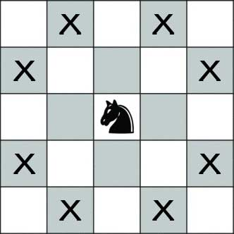
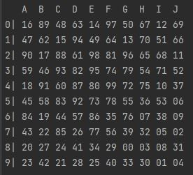
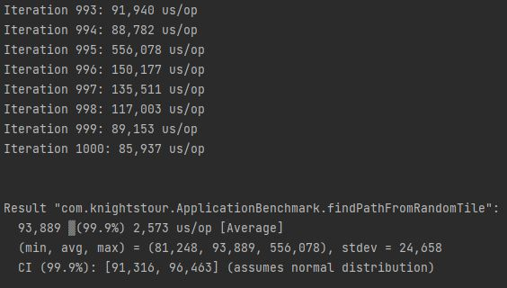
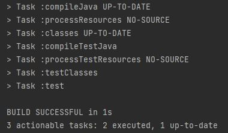

# Problem

A knight's tour is a sequence of moves of a knight on a chessboard such that the knight visits every tile exactly once.

# Run

Required JDK 8 or later.

## Command

    gradlew run --args=<startTile>

The *startTile* is a chess algebraic notation:  
First it's a letter from A to J representing the column, concatenated with a number from 0 to 9 representing the row.  
Examples are B2, J1, G8, and so on.

### Output

Every tile has a number representing the visit order:
- 0 is the start tile.
- 99 is the last tile.

The solution above starts at G8 and finishes at F4.

# What it does
From the *startTile*, the algorithm chooses the next tile based on the one that have fewer possible moves, 
and repeats this until a solution is found. If in the process a tile with no valid moves were reach, the algorithm stops and starts over.  
The movement's order of the next tile choice process is done "randomly", 
therefore if the algorithm start over there is a lower probability to do the same path as before.

# How it is implemented
There are four main classes on the project

- Tile - It is a domain class representing the board tile.
- Movement - It is a domain class representing a movement.
  - move - Generate a tile based on the received tile and axes modifiers.
- ChessPathService - Contain the algorithm implementation.
  - findPath - Returns the solution as a list representing the board based on the *boardIndex* method.
  - boardIndex - Calculates the tile index on the board list.
  - findResult - Look for every next tile until an invalid or the last one is found.
  - nextTile - Find the next tile with fewer possible moves and add its order to the board list.
  - possibleMoves - Calculates a tile's possible moves.
  - validNextTile - Verify if a tile is valid.
- Application - Contain the main class.
  - main - Retrieve input *startTile* and call the *findPath* method.
  - printBoard - Prints the board list based on the *boardIndex* method.

# Benchmark Average Time

Benchmark using [Java Microbenchmark Harness (JMH)](https://openjdk.java.net/projects/code-tools/jmh).

> JMH is a Java harness for building, running, and analysing nano/micro/milli/macro benchmarks
> written in Java and other languages targeting the JVM.

## Command

    gradlew clean jmh

### Output

After a warmup interaction, it does 1000 samples showing each time spent.  
The result contains the minimum, average and maximum values.

# Unit Test

Unit test using [JUnit](https://junit.org/junit5/).

## Command

    gradlew test

### Output

The feedback it's the build success.
